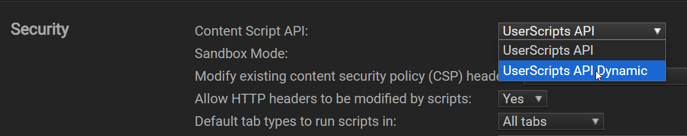
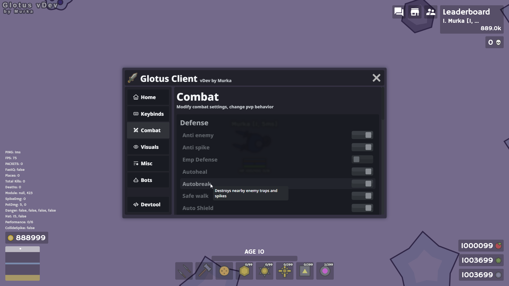
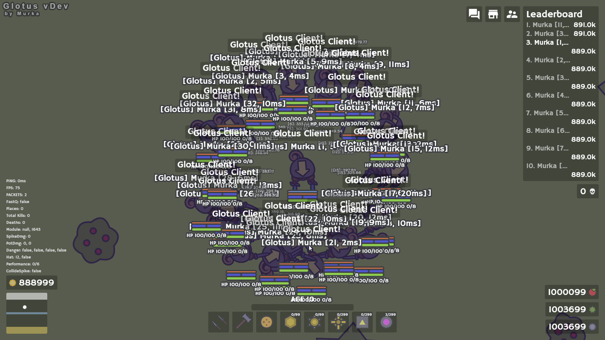

# Glotus Client
> An excellent Moomoo.io hack for a comfortable gaming experience

### Installation
1. **DOWNLOAD ON GREASYFORK**: [Glotus client](https://greasyfork.org/en/scripts/550867-glotus-client-moomoo-io)
2. **DOWNLOAD FROM SOURCE**: [Source](https://github.com/Murka007/Glotus-Client/blob/main/build/index.js)
3. **Or Build Locally**: `clone repo > bun install > bun start > install glotus_client_dev.user.js in tampermonkey`

### IMPORTANT
Before installing this script, in the tampermonkey settings change `General > Config mode` to `Advanced` and make sure to switch `Security > Content Script API` to `UserScripts API Dynamic` and then click on `Save`, otherwise script **won't load correctly**.
 

### ⚔️ Basic features
- Autoheal - detects all potential threats and heals accordingly
- Autohat - depending on the combat scenario, equips the hat or accessory you need
- ShameResetter - equips BullHat perfectly, to reset shame count efficiently to avoid getting clown
- Autobreak - used to get out of the trap as fast as possible
- Autoplace - automatically places items to gain advantage in combat
- Automills - places windmills to upgrade yourself as fast as possible, works better on sandbox
- Bots - additional combat vector, simplifies the gameplay drastically
- A lot of combat features (check all the modules yourself)
- Beautiful visuals, intended for proper testing

### ❤️ SUPPORT
&nbsp;&nbsp;&nbsp;[Discord](https://discord.gg/cPRFdcZkeD) 

&nbsp;&nbsp;&nbsp;[Github](https://github.com/Murka007/Glotus-Client) 

&nbsp;&nbsp;&nbsp;[Greasyfork](https://greasyfork.org/en/users/919633-murka007) 